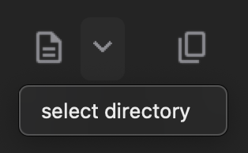
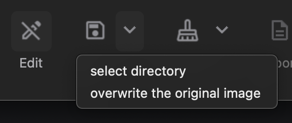

<div align="center">
    
    <h1>Stable Diffusion Prompt Reader</h1>
    <a href="https://github.com/receyuki/stable-diffusion-prompt-reader/releases/latest">
        </a>
    <a href="https://github.com/receyuki/stable-diffusion-prompt-reader/blob/master/LICENSE">
        </a>
    <a href="https://github.com/receyuki/stable-diffusion-prompt-reader/releases/latest">
        </a>
    <a href="https://pypi.org/project/sd-prompt-reader/">
        </a>
    <a href="https://github.com/psf/black">
        </a>
    
    <br><br>

[English](https://github.com/receyuki/stable-diffusion-prompt-reader/blob/master/README.md) | [简体中文](https://github.com/receyuki/stable-diffusion-prompt-reader/blob/master/README.zh-Hans.md)

一个独立的简易 AI 图片 prompt 查看器，用于在不依赖 webui 的情况下提取由 Stable Diffusion 生成图片内包含的 prompt
    <br>
  <p>
    <a href="#功能">功能</a> •
    <a href="#支持格式">支持格式</a> •
    <a href="#下载">下载</a> •
    <a href="#使用方式">使用方式</a> •
    <a href="#命令行">命令行</a> •
    <a href="https://github.com/receyuki/comfyui-prompt-reader-node">ComfyUI Node</a> •
    <a href="#常见问题">常见问题</a> •
    <a href="#credits">Credits</a>
  </p>
    
</div>

> [!TIP]
> SD Prompt Reader 现在可作为 ComfyUI 节点使用。查看 
> [ComfyUI Prompt Reader Node](https://github.com/receyuki/comfyui-prompt-reader-node) 了解更多信息。

## 功能
- 支持 macOS、 Windows 和 Linux
- 提供图形界面和命令行两种交互方式
- 简单的拖放交互
- 复制 prompt 到剪贴板
- 去除图片中的 prompt
- 导出 prompt 到 txt 文件
- 编辑或导入 prompt 到图片
- 竖排显示以及根据字母排序
- 检测生成工具
- 支持多种格式
- 支持系统深色和浅色模式

## 支持格式
|                                                                                     | PNG | JPEG | WEBP | TXT* |
|-------------------------------------------------------------------------------------|:---:|:----:|:----:|:----:|
| [A1111's webUI](https://github.com/AUTOMATIC1111/stable-diffusion-webui)            |  ✅  |  ✅   |  ✅   |  ✅   |
| [Easy Diffusion](https://github.com/easydiffusion/easydiffusion)                    |  ✅  |  ✅   |  ✅   |      |
| [StableSwarmUI](https://github.com/Stability-AI/StableSwarmUI)*                     |  ✅  |  ✅   |      |      |
| [StableSwarmUI (0.5.8-alpha 之前的版本)](https://github.com/Stability-AI/StableSwarmUI)* |  ✅  |  ✅   |      |      |
| [Fooocus-MRE](https://github.com/MoonRide303/Fooocus-MRE)*                          |  ✅  |  ✅   |      |      |
| [NovelAI (stealth pnginfo)](https://novelai.net/)                                   |  ✅  |      |  ✅   |      |
| [NovelAI (旧版)](https://novelai.net/)                                                |  ✅  |      |      |      |
| [InvokeAI](https://github.com/invoke-ai/InvokeAI)                                   |  ✅  |      |      |      |
| [InvokeAI (2.3.5-post.2 之前的版本)](https://github.com/invoke-ai/InvokeAI)              |  ✅  |      |      |      |
| [InvokeAI (1.15 之前的版本)](https://github.com/invoke-ai/InvokeAI)                      |  ✅  |      |      |      |
| [ComfyUI](https://github.com/comfyanonymous/ComfyUI)*                               |  ✅  |      |      |      |
| [Draw Things](https://drawthings.ai/)                                               |  ✅  |      |      |      |
| Naifu(4chan)                                                                        |  ✅  |      |      |      |

\* 见[格式限制](#TXT).

> [!NOTE]
> 如果你使用的工具或格式不在这个列表中, 请帮助我支持你的格式: 将你的工具生成的原始图片文件上传到 issues, 谢谢.

> [!TIP]
> 对于 ComfyUI 用户，SD Prompt Reader 现在可作为 ComfyUI 节点使用。
> [ComfyUI Prompt Reader Node](https://github.com/receyuki/comfyui-prompt-reader-node) 是本项目的一个子项目，建议在你的工作流程中嵌入其中的 [Prompt Saver node](https://github.com/receyuki/comfyui-prompt-reader-node#prompt-saver-node--parameter-generator-node) 以确保最大的兼容性。

## 下载
### Windows 用户
从 [GitHub Releases](https://github.com/receyuki/stable-diffusion-prompt-reader/releases/latest) 下载可执行文件
### macOS 用户
从 [GitHub Releases](https://github.com/receyuki/stable-diffusion-prompt-reader/releases/latest) 下载可执行文件
#### 通过 Homebrew Cask 安装
你也可以通过 [Homebrew](http://brew.sh/) cask 安装 SD Prompt Reader.  
```bash
brew install --no-quarantine receyuki/sd-prompt-reader/sd-prompt-reader
```
使用 `--no-quarantine` 参数是因为目前 SD Prompt Reader 并未签名, 具体原因请查看[这里](https://github.com/receyuki/stable-diffusion-prompt-reader/blob/master/README.zh-Hans.md#sd-prompt-readerapp-%E5%B7%B2%E6%8D%9F%E5%9D%8F%E6%97%A0%E6%B3%95%E6%89%93%E5%BC%80%E6%82%A8%E5%BA%94%E8%AF%A5%E5%B0%86%E5%AE%83%E7%A7%BB%E5%88%B0%E5%BA%9F%E7%BA%B8%E7%AF%93)

### Linux 用户 (不定期测试)
~~我很确定 Linux 用户可以在没有可执行文件的情况下搞明白怎么用~~
- 最低Python版本要求: 3.10
- 确保你的 Python 中安装了 tkinter 包.  
如果没有，请使用软件包管理器安装 python3-tk 包.  
e.g. `sudo apt-get install python3-tk` (基于 Debian 的发行版)  

你可以选择使用 pip 进行安装或者手动运行
#### 使用 pip 或 pipx 安装
```bash
pip install sd-prompt-reader
```
or
```bash
pipx install sd-prompt-reader
```
在终端内输入 `sd-prompt-reader` 来启动 app.
#### 手动运行源码
1. Clone repo
    ```bash
    git clone https://github.com/receyuki/stable-diffusion-prompt-reader.git
    ```
   或者直接下载 repo 为 zip 格式.
2. CD 到文件夹并安装依赖
    ```bash
    cd stable-diffusion-prompt-reader  
    pip install -r requirements.txt
    ```
3. Run
    ```bash
   python main.py
   ```

## 使用方式
### 读取 prompt
- 打开可执行文件 (.exe 或 .app) 并将图片拖入窗口.

或
- 右键图片选择使用 SD Prompt Reader 作为打开方式

或
- 直接将图片拖入可执行文件 (.exe 或 .app).

### 导出 prompt 到 txt 文件
- 点击 "Export" 将在图像文件旁生成一个txt文件.
- 要保存到另一个位置, 点击展开的箭头并点击 "select directory".  


### 去除图片中的 prompt
- 点击 "Clear" 将在原图像文件旁生成一个后缀为"_data_removed"的图像文件.
- 要保存到另一个位置, 点击展开的箭头并点击 "select directory".  
- 要覆盖原始图像文件, 点击展开的箭头并点击 "overwrite the original image".  


### 编辑图片
> [!NOTE]
> 编辑后的图片将以 A1111 格式进行写入, 这意味着任何格式的图片在编辑后都将变为 A1111 格式.

- 点击 "Edit" 进入编辑模式
- 直接在文本框中编辑 prompt, 或者导入 txt 格式的prompt数据.  
- 点击 "Save" 将在原图像文件旁生成一个后缀为 "_edited" 的编辑后图像文件.  
- 要保存到另一个位置, 点击展开的箭头并点击 "select directory".  
- 要覆盖原始图像文件, 点击展开的箭头并点击 "overwrite the original image".  


### 复制为单行 prompt
将图片 prompt 和设置复制为可被 [Prompts from file or textbox](https://github.com/AUTOMATIC1111/stable-diffusion-webui/wiki/Features#prompts-from-file-or-textbox) 读取的格式
支持以下参数:

| 设置                      | 参数                   |
|-------------------------|----------------------|
| Seed                    | --seed               |
| Variation seed strength | --subseed_strength   |
| Seed resize from        | --seed_resize_from_h |
| Seed resize from        | --seed_resize_from_w |
| Sampler                 | --sampler_name       |
| Steps                   | --steps              |
| CFG scale               | --cfg_scale          |
| Size                    | --width              |
| Size                    | --height             |
| Face restoration        | --restore_faces      |

- 点击展开的箭头并点击 "single line prompt".
- 将其粘贴到 webui 脚本 "Prompts from file or textbox" 下方的文本框.  


### ComfyUI SDXL 流程
> [!NOTE]
> SDXL 流程不支持编辑，如有需要请去除图片中的 prompt 后再进行编辑

如果图片中 workflow 包含多组 SDXL 的 prompt, 
也就是 Clip G(text_g), Clip L(text_l) 和 Refiner 时, 
SD Prompt Reader 会切换到如下图所示的多组 prompt 显示模式.
多组 prompt 显示模式有两种界面供你选择，你可以通过按钮来进行切换.  


## 命令行
可用于读取、修改和清除图像的元数据的命令行工具
### 平台
#### Windows 用户
`SD Prompt Reader CLI.exe` 将作为一个独立的可执行文件放置在压缩包中.   
例示:
`"SD Prompt Reader CLI.exe" -i example.png`  
#### macOS 用户
可执行文件位于 `SD Prompt Reader.app/Contents/MacOS/SD Prompt Reader`.  
例示:
`/Applications/SD\ Prompt\ Reader.app/Contents/MacOS/SD\ Prompt\ Reader -i example.png`  
#### pip 用户
示例:
`sd-prompt-reader-cli -i example.png`
### 模式和选项
#### 模式
- 读取模式：通过 `-r` 或 `--read` 标志激活.
- 写入模式：通过 `-w` 或 `--write` 标志激活.
- 清除模式：通过 `-c` 或 `--clear` 标志激活.
#### 常规选项
- `-i`, `--input-path`: 输入图像文件的路径或包含图像文件的目录, 必需参数.
- `-o`, `--output-path`: 处理后文件保存的输出文件或目录路径.
- `-l`, `--log-level`: 指定日志的详细级别(如 DEBUG、INFO、WARN、ERROR).
#### 读取选项
- `-f`, `--format-type`: 指定输出元数据的格式，选择为 "TXT" 或 "JSON". 默认格式为 "TXT"
#### 写入选项
- `-m`, `--metadata`: 提供用于写入的元数据文件.
- `-p`, `--positive`: 提供用于写入的正面prompt.
- `-n`, `--negative`: 提供用于写入的负面prompt串.
- `-s`, `--setting`: 提供用于写入的设置信息.
### 基本用法
- 如果未指定输出路径, 修改后的图像会保存在当前目录中, 并在原始文件名后加上后缀.
- 如需覆盖源文件, 请将输出路径设置为与输入路径相同.
- 写入模式仅支持对单个图像进行修改.
#### 读取模式
- 从图像中读取元数据.
- 用法:  
`sd-prompt-reader-cli [-r] -i <input_path> [--format-type <format>] [-o <output_path>]`
- 示例:  
`sd-prompt-reader-cli -i example.png`  
`sd-prompt-reader-cli -i example.png -o metadata.txt`  
`sd-prompt-reader-cli -r -i example.png -f TXT -o output_folder/`  
`sd-prompt-reader-cli -r -i input_folder/ -f JSON -o output_folder/`
#### 写入模式
- 将元数据写入图像.
- 用法:  
`sd-prompt-reader-cli -w -i <input_path> -m <metadata_path> [-o <output_path>]`
- 示例:  
`sd-prompt-reader-cli -w -i example.png -m new_metadata.txt`  
`sd-prompt-reader-cli -w -i example.png -m new_metadata.txt -o output.png`  
`sd-prompt-reader-cli -w -i example.png -m new_metadata.json -o output_folder/`
#### 清除模式
- 从图像中删除所有元数据.
- 用法:  
`sd-prompt-reader-cli -c -i <input_path> [-o <output_path>]`
- 示例:  
`sd-prompt-reader-cli -c -i example.png`  
`sd-prompt-reader-cli -c -i example.png -o output.png`  
`sd-prompt-reader-cli -c -i example.png -o output_folder/`  
`sd-prompt-reader-cli -c -i input_folder/ -o output_folder/`

## 格式限制
### TXT
1. txt 文件仅能在编辑模式下导入.
2. 仅支持 A1111 格式的 txt 文件. 你可以使用 A1111 webui 生成的txt文件, 或使用 SD prompt reader 从 A1111 生成的图片中导出 txt.
### StableSwarmUI
> [!IMPORTANT]
> StableSwarmUI 依然处于 Alpha 测试状态，其格式未来可能会发生改变, 我将会持续跟进 StableSwarmUI 未来的更新.
### ComfyUI
> [!IMPORTANT]
> 当流程过于复杂或者使用自定义节点时，SD Prompt Reader 有很大概率无法正确显示元数据。这是由于 ComfyUI 并不储存元数据，而是储存完整的流程。
> SD Prompt Reader 仅能处理基础的工作流程.
> 建议在你的工作流程中嵌入 [ComfyUI Prompt Reader Node](https://github.com/receyuki/comfyui-prompt-reader-node) 中的 [Prompt Saver node](https://github.com/receyuki/comfyui-prompt-reader-node#prompt-saver-node--parameter-generator-node) 以确保最大的兼容性.

1. 如果设置框中有多组数据(seed, steps, CFG, etc.)，这意味着流程中有多个 KSampler 节点
2. 由于 ComfyUI 的特性, workflow 中的所有节点和流程都存储在图像中, 包括没有被使用的. 并且一个流程可以有多个分支，多个输入和输出.
(e.g. 在一个流程中同时生成原图和 hires. fix 后的图像)
SD Prompt Reader 会遍历所有的流程和分支，并显示拥有完整的输入和输出的最长分支.
3. [ComfyUI SDXL 流程](https://github.com/receyuki/stable-diffusion-prompt-reader/blob/master/README.zh-Hans.md#comfyui-sdxl-%E6%B5%81%E7%A8%8B)
### Easy Diffusion
默认设置下, Easy Diffusion 不会将 prompt 写入图片. 请更改设置中的 _Metadata format_ 为 _embed_ 来写入 prompt 到图片中.
### Fooocus-MRE
由于原版的 [Fooocus](https://github.com/lllyasviel/Fooocus) 并不支持将 metadata 写入图片文件, 
SD Prompt Reader 仅支持由 [Fooocus MoonRide Edition](https://github.com/MoonRide303/Fooocus-MRE) 生成的图片.

## 常见问题
### 病毒警告
> [!WARNING]
> 错误的病毒警报是由我使用的打包工具 _pyinstaller_ 造成的, 这对 _pyinstaller_ 用户是一个常见的问题. 
> 我花费了许多时间来解决 Windows Defender 的错误警报, 但我没法对每个杀毒软件单独解决问题. 
> 因此, 你可以选择相信 Windows Defender 或者使用 Linux 用户的使用说明来使用 app.
### "SD Prompt Reader.app" 已损坏，无法打开。您应该将它移到废纸篓。
> [!IMPORTANT]
> 这是一个使用非 appstore 的未签名软件时常见的 macOS 问题, 开发者需要付给苹果每年 $99 来避免这个问题. 
> 你可以在设置中**隐私与安全性**的**安全性**中选择**允许任何来源**, 但这可能造成危险. 
> 我推荐的方式是移除 quarantine attributes.
1. 在应用程序中打开终端. 
2. 输入以下命令并按回车. 

    `xattr -r -d com.apple.quarantine app的路径`

    比如:

    `xattr -r -d com.apple.quarantine /Applications/SD\ Prompt\ Reader.app`

如果你仍然担心安全性可以选择使用 Linux 用户的使用说明来使用 app.

## 待办
- 图像批处理功能
- 多图像/文件夹模式
- 用户设置

## Credits
- Inspired by [Stable Diffusion web UI](https://github.com/AUTOMATIC1111/stable-diffusion-webui/)
- App icon generated using Stable Diffusion with [IconsMI](https://huggingface.co/jvkape/IconsMI-AppIconsModelforSD)
- Special thanks to [Azusachan](https://github.com/Azusachan) for providing SD server
- The NovelAI stealth pnginfo parser is based on [the official metadata extraction script of NovelAI](https://github.com/NovelAI/novelai-image-metadata)
